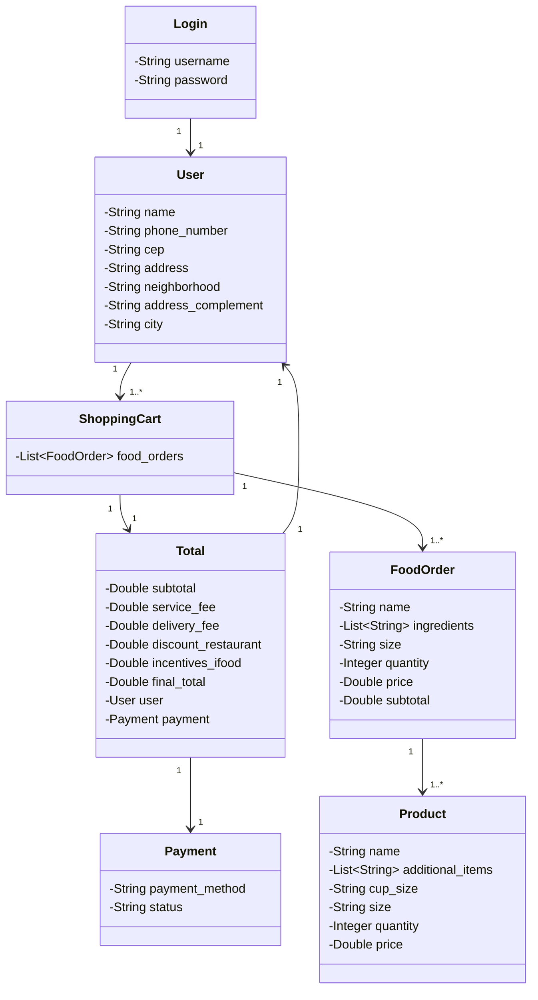

# Desafio-da-DIO-Criando-API-Ifood
Java RESTful API criada para o desafio da DIO.

# Diagrama de Classes

```mermaid
classDiagram
    class Login {
        -String username
        -String password
    }
    
    class User {
        -String name
        -String phone_number
        -String cep
        -String address
        -String neighborhood
        -String address_complement
        -String city
    }
    
    class Product {
        -String name
        -List~String~ additional_items
        -String cup_size
        -String size
        -Integer quantity
        -Double price
    }
    
    class ShoppingCart {
        -List~FoodOrder~ food_orders
    }
    
    class FoodOrder {
        -String name
        -List~String~ ingredients
        -String size
        -Integer quantity
        -Double price
        -Double subtotal
    }
    
    class Total {
        -Double subtotal
        -Double service_fee
        -Double delivery_fee
        -Double discount_restaurant
        -Double incentives_ifood
        -Double final_total
        -User user
        -Payment payment
    }
    
    class Payment {
        -String payment_method
        -String status
    }
    
    Login "1" --> "1" User
    User "1" --> "1..*" ShoppingCart
    ShoppingCart "1" --> "1" Total
    ShoppingCart "1" --> "1..*" FoodOrder
    FoodOrder "1" --> "1..*" Product
    Total "1" --> "1" User
    Total "1" --> "1" Payment
```
